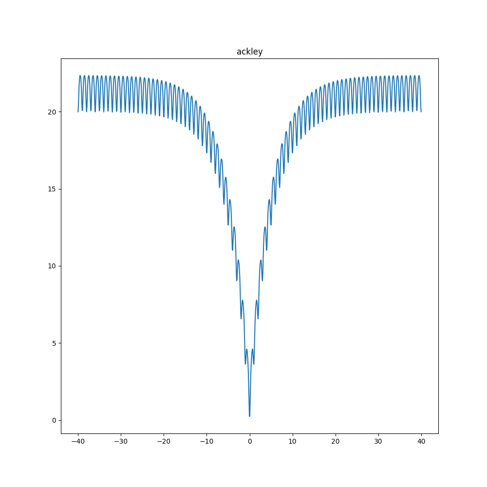
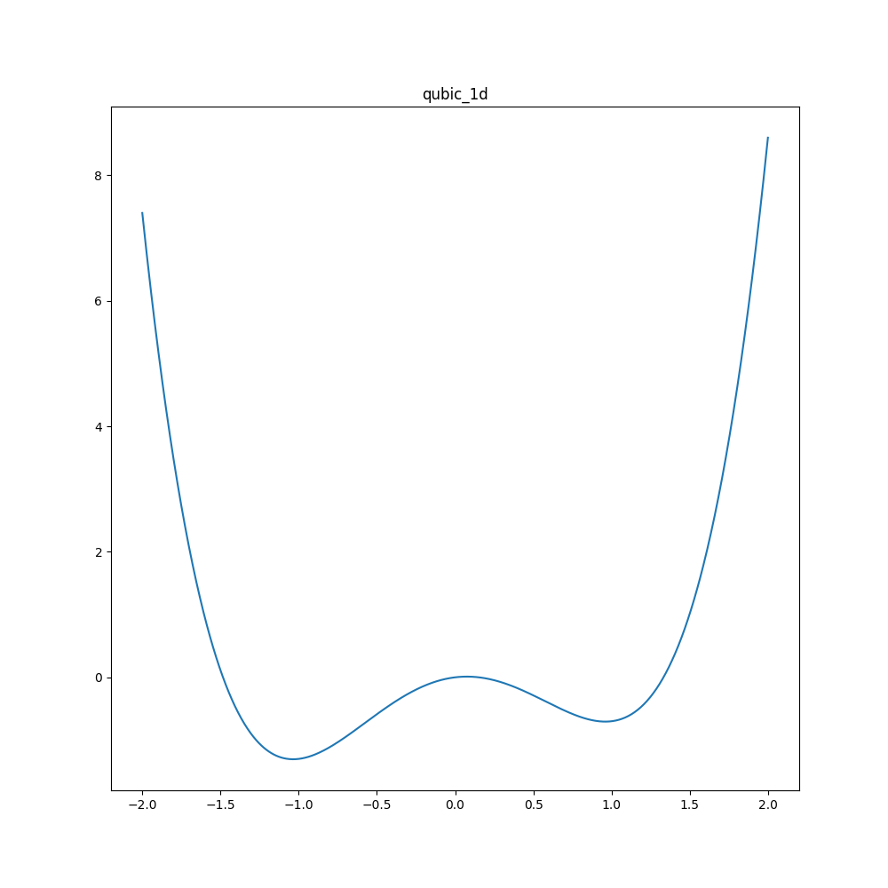
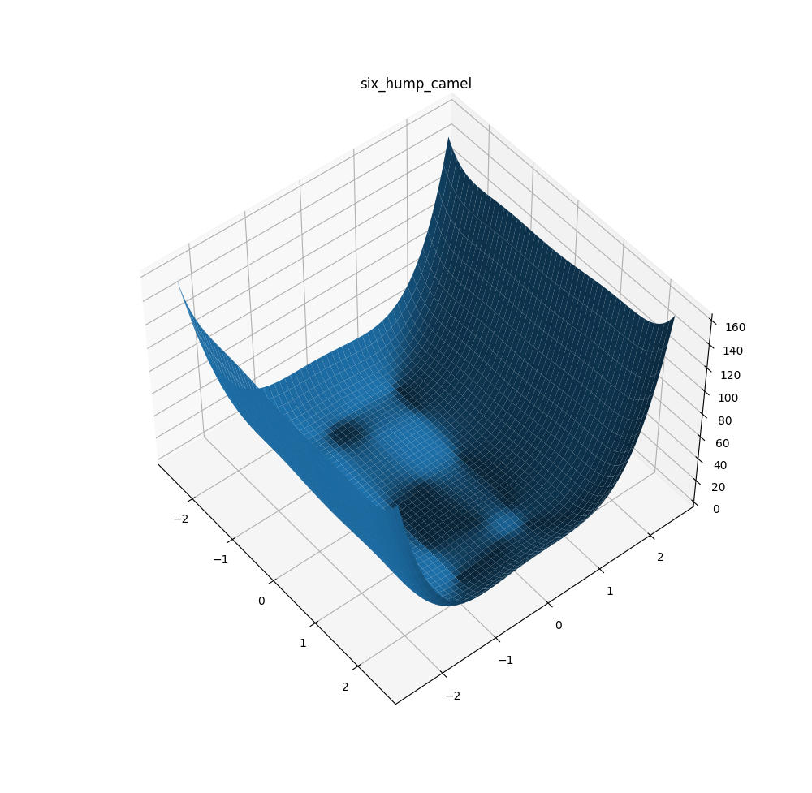

# nn_optimization
Optimization using overparameterization with neural networks

## Installation

Clone the repo and execute the following commands from the repository's root.

Install the `nn_optimization` package in development mode:
```
pip install -e .
```

## Optimizing analytical functions

```
python scripts/train.py --config-name config
```
where `config` is a config file in `config/` that specifies the optimization setup.

The config can be overwritten through the command line. For example, when wanting to use
direct rather than indirect optimization:

```
python scripts/train.py --config-name config model=parameter
```

## Visualizing loss functions

Example:
```
python scripts/viz_loss.py --function_name ackley --range 40 --one_dim
```

See `python scripts/viz_loss.py -h` for the available arguments.

## Example results

### 1D Ackley function

#### Visualization



This function has a global minimum at `x=0.0` with a loss of `0.0`.

#### Direct optimization

Optimizing the input coordinate directly leads to us getting stuck in a local minima.

```
python scripts/train.py --config-name config model=parameter \
trainer.initialization.init_condition=[10.0] lossfun=ackley
```

We reach `x=9.99495` with a loss of `17.29193`. This corresponds to a local minima close
to the initial condition.

#### Optimization with overparameterization

Optimizing in an overparameterized decision variable space (neural network weights)
allows us to reach the global minima.

```
python scripts/train.py --config-name config model=mlp9 \
trainer.initialization.init_condition=[10.0] lossfun=ackley \
model.in_ch=128 model.hidden_ch=512
```

We reach `x=0.00026` with a loss of `0.00104`. This corresponds to the global minimum
up to some numerical accuracy.

### 1D Qubic function

#### Visualization



This function has a global minimum at `x=-1.036` with a loss of `-1.305`. It also has
a suboptimal local minima at `x=0.96` with a loss of `-0.706`. 

#### Direct optimization

Optimizing the input coordinate directly leads to us getting stuck in a local minima.

```
python scripts/train.py --config-name config model=parameter \
trainer.initialization.init_condition=[0.96] lossfun=qubic_1d
```

We reach `x=0.96015` with a loss of `-0.70585`. This corresponds to not leaving the
local minima that we started in.

#### Optimization with overparameterization

Optimizing in an overparameterized decision variable space (neural network weights)
allows us to reach the global minima.

```
python scripts/train.py --config-name config model=mlp17 \
trainer.initialization.init_condition=[0.96] lossfun=qubic_1d \
model.in_ch=128 model.hidden_ch=1024
```

We reach `x=0.96234` with a loss of `-0.70584`. No overparameterization seems to be
sufficient to escape this local minimum.

### Six-Hump Camel



There are local minima at `x=(0.0898,-0.7126)` and `x=(-0.0898, 0.7126)` with a loss of
`-1.0316`.

#### Direct optimization

Optimizing the input coordinate directly leads to us getting stuck in a local minima.

```
python scripts/train.py --config-name config model=parameter \
trainer.initialization.init_condition=[2.0,2.0] lossfun=six_hump_camel \
model.out_ch=2 trainer.epochs=6000
```

We reach `x=(1.6,0.6)` with a loss of `2.108`.


#### Indirect optimization

Optimizing in an overparameterized decision variable space (neural network weights)
allows us to reach the global minima.

```
python scripts/train.py --config-name config model=mlp9 \
trainer.initialization.init_condition=[2.0,2.0] lossfun=six_hump_camel \
model.out_ch=2 trainer.epochs=500
```

We reach `x=(0.0898,-0.7126)` with a loss of `-1.0316`. This corresponds to the one of
the two global minima.
